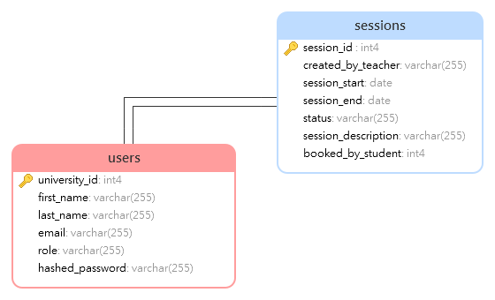
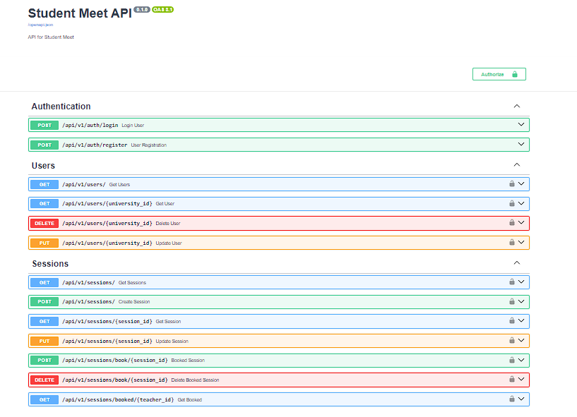

<a name="readme-top"></a>

# 📗 Table of Contents

- [📖 About the Project](#about-project)
  - [:camera: screenshots](#screenshots)
  - [🛠 Built With](#built-with)
    - [Tech Stack](#tech-stack)
    - [Key Features](#key-features)
    - [🚀 Live Demo](#live-demo)
- [💻 Getting Started](#getting-started)
  - [Setup](#setup)
  - [Prerequisites](#prerequisites)
  - [Usage](#usage)
- [👥 Authors](#authors)
- [🔭 Future Features](#future-features)
- [🤝 Contributing](#contributing)
- [⭐️ Show your support](#support)
- [📝 License](#license)

# 🤖 Student Meet <a name="about-project"></a>

>Connect students and teachers through scheduled sessions. Experience a seamless platform that brings together the power of scheduling and interaction.


## :camera: screenshots <a name="screenshots"></a>
  - Databse schema
  
  - API documentation
  


## 🛠 Built With <a name="built-with"></a>

### Tech Stack <a name="tech-stack"></a>

- <a href="https://fastapi.tiangolo.com/">FastAPI</a>
- <a href="https://www.postgresql.org/">Postgresql</a>


### :rocket: Live Demo <a name="live-demo"></a>

  - Coming soon

### Key Features <a name="key-features"></a>

- [x] User registration
- [x] User login
- [x] Session creation
- [x] Session booking

<p align="right">(<a href="#readme-top">back to top</a>)</p>

## 💻 Getting Started <a name="getting-started"></a>

To get a local copy up and running, follow these steps.

### Prerequisites

In order to run this project you need:

- Command line or terminal
- IDE such as VsCode.
- Python 3.8 or higher
- Postgresql 13 or higher

### Setup

Clone this repository to your desired folder:
Example command:

```sh
  git clone https://github.com/zewdu444/student_meet.git
  cd student_meet

```

### Usage

 Backend API

```sh
  cd api
  pip install -r requirements.txt
  uvicorn main:app --reload
  open  http://localhost:8000/docs
```


## 👥 Authors <a name="authors"></a>

👤 **Zewdu Erkyhun**

- GitHub: [@zewdu444](https://github.com/zewdu444)
- Twitter: [@zewdu444](https://twitter.com/zewdu444)
- LinkedIn: [zewdu-anley](https://www.linkedin.com/in/zewdu-anley/)


<p align="right">(<a href="#readme-top">back to top</a>)</p>

## 🔭 Future Features <a name="future-features"></a>

- I am working on the  Live hosting and integration to frontend part

<p align="right">(<a href="#readme-top">back to top</a>)</p>

## 🤝 Contributing <a name="contributing"></a>

Contributions, issues, and feature requests are welcome!

Feel free to check the [issues page](https://github.com/zewdu444/student_meet/issues).

<p align="right">(<a href="#readme-top">back to top</a>)</p>

## ⭐️ Show your support <a name="support"></a>

Give a ⭐️ if you like this project!

<p align="right">(<a href="#readme-top">back to top</a>)</p>


<p align="right">(<a href="#readme-top">back to top</a>)</p>

## 📝 License <a name="license"></a>

This project is [MIT](./LICENSE) licensed.

<p align="right">(<a href="#readme-top">back to top</a>)</p>


